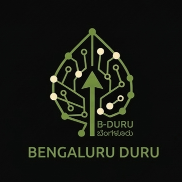

<div align="center">
  
  
  <h1>BengaluruDuru / ಬೆಂಗಳೂರುದುರು</h1>
  <p><b>Your neighborhood's voice, powered by Generative AI. <br> ನಿಮ್ಮ ನೆರೆಹೊರೆಯ ಧ್ವನಿ, ಜನರೇಟಿವ್ AI ನಿಂದ ನಿಯಂತ್ರಿಸಲ್ಪಡುತ್ತದೆ.</b></p>

  <!-- SOCIAL BADGES -->
  <a href="https://github.com/bchbenjamin/bfb.2.2/stargazers">
    
  </a>
  <a href="https://github.com/bchbenjamin/bfb.2.2/network/members">
    
  </a>
  <a href="https://github.com/bchbenjamin/bfb.2.2/issues">
    
  </a>
  <a href="https://opensource.org/licenses/MIT">
    
  </a>
</div>

<br />

<!-- 
=======================================================================
TEAM INSTRUCTIONS FOR MEDIA:
1. DEMO VIDEO: Upload your demo video to YouTube. Take a screenshot of the video player, save it in the repository (e.g., `client/public/demo-thumbnail.png`), and replace the links below.
2. SCREENSHOTS: Replace the placeholder URLs in the "Features" section with actual raw GitHub URLs of your app screenshots.
=======================================================================
-->

## 🎬 See it in Action / ಕಾರ್ಯಾಚರಣೆಯಲ್ಲಿ ನೋಡಿ

<div align="center">
  <a href="[INSERT_YOUTUBE_LINK_HERE]">
    
  </a>
  <p><i>Click the image above to watch the pitch & demo! <br> ಪಿಚ್ ಮತ್ತು ಡೆಮೊ ವೀಕ್ಷಿಸಲು ಮೇಲಿನ ಚಿತ್ರವನ್ನು ಕ್ಲಿಕ್ ಮಾಡಿ!</i></p>
</div>

---

## 🚀 The Vision / ದೃಷ್ಟಿಕೋನ
Reporting civic issues like potholes, broken streetlights, or water shortages is often tedious, undocumented, and ignored. **BengaluruDuru** revolutionizes citizen-government interaction. By leveraging Google's **Gemini 2.5 Flash API**, we eliminate manual form-filling, automatically categorize grievances using NLP, group duplicate complaints geographically, and demand visual proof of resolution—ensuring unprecedented civic accountability.

ರಸ್ತೆಗುಂಡಿಗಳು, ಮುರಿದ ಬೀದಿ ದೀಪಗಳು ಅಥವಾ ನೀರಿನ ಕೊರತೆಯಂತಹ ನಾಗರಿಕ ಸಮಸ್ಯೆಗಳನ್ನು ವರದಿ ಮಾಡುವುದು ತ್ರಾಸದಾಯಕವಾಗಿದೆ. **ಬೆಂಗಳೂರುದುರು** ನಾಗರಿಕ ಮತ್ತು ಸರ್ಕಾರದ ಪರಸ್ಪರ ಕ್ರಿಯೆಯನ್ನು ಕ್ರಾಂತಿಗೊಳಿಸುತ್ತದೆ. Google ನ **Gemini 2.5 Flash API** ಅನ್ನು ಬಳಸಿಕೊಂಡು, ನಾವು ಹಸ್ತಚಾಲಿತ ನಮೂನೆ ಭರ್ತಿಯನ್ನು ನಿವಾರಿಸುತ್ತೇವೆ, NLP ಬಳಸಿಕೊಂಡು ಕುಂದುಕೊರತೆಗಳನ್ನು ಸ್ವಯಂಚಾಲಿತವಾಗಿ ವರ್ಗೀಕರಿಸುತ್ತೇವೆ, ನಕಲಿ ದೂರುಗಳನ್ನು ಭೌಗೋಳಿಕವಾಗಿ ಗುಂಪು ಮಾಡುತ್ತೇವೆ ಮತ್ತು ಪರಿಹಾರದ ದೃಶ್ಯ ಪುರಾವೆಯನ್ನು ಒತ್ತಾಯಿಸುತ್ತೇವೆ.

---

## 🧠 Key Technical Innovations / ಪ್ರಮುಖ ತಾಂತ್ರಿಕ ಆವಿಷ್ಕಾರಗಳು

- **Zero-Friction Filing via NLP / NLP ಮೂಲಕ ತಡೆರಹಿತ ಸಲ್ಲಿಕೆ:** Users just type _"Huge pothole near MG Road junction."_ Our custom Gemini AI pipeline extracts the exact location, categorizes the issue (e.g., *Roads & Footpaths > Pothole*), assigns a Priority (1-5), and auto-routes it—all under 800ms. | ಬಳಕೆದಾರರು ಕೇವಲ ಸಮಸ್ಯೆಯನ್ನು ಟೈಪ್ ಮಾಡುತ್ತಾರೆ, ನಮ್ಮ ಎಐ ಸ್ಥಳ, ವರ್ಗ ಮತ್ತು ಆದ್ಯತೆಯನ್ನು ಸ್ವಯಂಚಾಲಿತವಾಗಿ 800ms ಒಳಗೆ ಹೊಂದಿಸುತ್ತದೆ.
- **Strict Structured AI Outputs / ಕಟ್ಟುನಿಟ್ಟಾದ ರಚನಾತ್ಮಕ AI ಔಟ್‌ಪುಟ್‌ಗಳು:** We implement Google's `SchemaType` enums at the API level. This entirely prevents AI hallucinations, forcing the model to select valid departments and severities that the BBMP (city council) database expects. | ನಾವು API ಮಟ್ಟದಲ್ಲಿ `SchemaType` ಅನ್ನು ಕಾರ್ಯಗತಗೊಳಿಸುತ್ತೇವೆ, ಇದು ಮಾನ್ಯವಾದ ವಿಭಾಗಗಳನ್ನು ಮಾತ್ರ ಆಯ್ಕೆ ಮಾಡಲು ಎಲ್ಎಲ್ಎಂ ಅನ್ನು ನಿರ್ಬಂಧಿಸುತ್ತದೆ.
- **Spatial Anomaly Detection / ಪ್ರಾದೇಶಿಕ ಅಸಂಗತತೆ ಪತ್ತೆ (Clustering):** The backend actively monitors coordinate geometry. If multiple citizens report "no water" within a 500-meter radius within 48 hours, the system auto-spikes the priority to *Emergency* and alerts officials of a possible pipe burst. | 48 ಗಂಟೆಗಳ ಒಳಗೆ 500 ಮೀಟರ್ ಸುತ್ತಳತೆಯಲ್ಲಿ ಬಹು ನಾಗರಿಕರು ಒಂದೇ ಸಮಸ್ಯೆಯನ್ನು ವರದಿ ಮಾಡಿದರೆ, ಸಿಸ್ಟಮ್ ಸ್ವಯಂಚಾಲಿತವಾಗಿ ಅಧಿಕಾರಿಗಳನ್ನು ಎಚ್ಚರಿಸುತ್ತದೆ.
- **AI-Powered Resolution Proof / AI ಆಧಾರಿತ ಪರಿಹಾರ ಪುರಾವೆ:** Government workers cannot just click "Resolved." They must upload a photo of the fixed issue. Gemini Vision cross-references the citizen's original photo against the officer's proof photo, generates a confidence match score, and blocks fraudulent closures. | ಅಧಿಕಾರಿಗಳು ಸಮಸ್ಯೆಯನ್ನು ಪರಿಹರಿಸಿದ ಫೋಟೋವನ್ನು ಅಪ್‌ಲೋಡ್ ಮಾಡಬೇಕು. Gemini Vision ಮೂಲ ಫೋಟೋದೊಂದಿಗೆ ಇದನ್ನು ಹೋಲಿಸುತ್ತದೆ.
- **Equitable Tech (i18n & TTS) / ಸಮಾನ ತಂತ್ರಜ್ಞಾನ:** Built for the masses. Deeply integrated i18n supporting English, Kannada, Tulu, and Konkani. Features a native Text-To-Speech (TTS) engine that reads the interface aloud for the visually impaired or non-literate. | ಇಂಗ್ಲಿಷ್, ಕನ್ನಡ, ತುಳು ಮತ್ತು ಕೊಂಕಣಿ ಭಾಷೆಗಳನ್ನು ಬೆಂಬಲಿಸುತ್ತದೆ ಮತ್ತು ಟೆಕ್ಸ್ಟ್-ಟು-ಸ್ಪೀಚ್ (TTS) ಹೊಂದಿದೆ.

---

## 📸 Platform Highlights / ಪ್ಲಾಟ್‌ಫಾರ್ಮ್ ಮುಖ್ಯಾಂಶಗಳು

<!-- INSTRUCTION: Add your real screenshots below. Replace "https://via.placeholder.com/..." with the path to your actual images -->

<details open>
<summary><b>1. Map-First Citizen Interface / ನಕ್ಷೆ-ಆಧಾರಿತ ನಾಗರಿಕ ಇಂಟರ್ಫೇಸ್ 🗺️</b></summary>
<br>

<em>Citizens can view live neighborhood issues, upvote ("I'm affected too!") to boost priority, or drop a pin to report a new problem. <br> ನಾಗರಿಕರು ನೆರೆಹೊರೆಯ ಸಮಸ್ಯೆಗಳನ್ನು ವೀಕ್ಷಿಸಬಹುದು, ಆದ್ಯತೆಯನ್ನು ಹೆಚ್ಚಿಸಲು ಅಪ್‌ವೋಟ್ ಮಾಡಬಹುದು ಅಥವಾ ಹೊಸ ಸಮಸ್ಯೆಯನ್ನು ವರದಿ ಮಾಡಬಹುದು.</em>
</details>

<details open>
<summary><b>2. Officer Dashboard & Analytics / ಅಧಿಕಾರಿಗಳ ಡ್ಯಾಶ್‌ಬೋರ್ಡ್ 📊</b></summary>
<br>

<em>A powerful command center for officials providing intelligent sorting, heatmap toggles, and real-time alerts. <br> ಅಧಿಕಾರಿಗಳಿಗೆ ಸ್ಮಾರ್ಟ್ ವಿಂಗಡಣೆ, ಹೀಟ್‌ಮ್ಯಾಪ್ ಮತ್ತು ನೈಜ-ಸಮಯದ ಎಚ್ಚರಿಕೆಗಳನ್ನು ಒದಗಿಸುವ ಶಕ್ತಿಶಾಲಿ ಡ್ಯಾಶ್‌ಬೋರ್ಡ್.</em>
</details>

<details open>
<summary><b>3. Resolution Verification Engine / ಪರಿಹಾರ ಪರಿಶೀಲನಾ ಎಂಜಿನ್ 📸</b></summary>
<br>

<em>Before and after comparisons powered by AI and human-in-the-loop (Citizen receives a 24-hour window to contest a fix). <br> AI ಮತ್ತು ನಾಗರಿಕರ ಪರಿಶೀಲನೆಯೊಂದಿಗೆ ಮೊದಲು ಮತ್ತು ನಂತರದ ಹೋಲಿಕೆಗಳು (ನಾಗರಿಕರಿಗೆ 24 ಗಂಟೆಗಳ ಕಾಲಾವಕಾಶವಿರುತ್ತದೆ).</em>
</details>

---

## 🛠️ Built With / ಇದರೊಂದಿಗೆ ನಿರ್ಮಿಸಲಾಗಿದೆ

<div align="center">
  
  
  
  
  
  
</div>

---

## ⚙️ Quick Start Guide / ತ್ವರಿತ ಪ್ರಾರಂಭ ಮಾರ್ಗದರ್ಶಿ

Want to run this locally? It takes less than 2 minutes. / ಇದನ್ನು ಸ್ಥಳೀಯವಾಗಿ ಚಲಾಯಿಸಲು ಬಯಸುವಿರಾ? ಇದು ಕೇವಲ 2 ನಿಮಿಷ ತೆಗೆದುಕೊಳ್ಳುತ್ತದೆ.

```bash
# 1. Clone the repository / ರೆಪೊಸಿಟರಿಯನ್ನು ಕ್ಲೋನ್ ಮಾಡಿ
git clone https://github.com/bchbenjamin/bfb.2.2.git
cd bfb.2.2

# 2. Install dependencies for both frontend and backend / ಫ್ರಂಟ್‌ಎಂಡ್ ಮತ್ತು ಬ್ಯಾಕೆಂಡ್ ಎರಡಕ್ಕೂ ಡಿಪೆಂಡೆನ್ಸಿಗಳನ್ನು ಸ್ಥಾಪಿಸಿ
npm install

# 3. Secure your environment / ನಿಮ್ಮ ಪರಿಸರವನ್ನು ಸುರಕ್ಷಿತಗೊಳಿಸಿ
# Create a .env file in the /server directory with your GEMINI_API_KEY and DATABASE_URL
# ಸರ್ವರ್ ಡೈರೆಕ್ಟರಿಯಲ್ಲಿ ನಿಮ್ಮ API ಕೀ ಮತ್ತು ಡೇಟಾಬೇಸ್ URL ನೊಂದಿಗೆ .env ಫೈಲ್ ರಚಿಸಿ
# Create a .env file in the /client directory with VITE_API_URL=http://localhost:3001
# ಕ್ಲೈಂಟ್ ಡೈರೆಕ್ಟರಿಯಲ್ಲಿ VITE_API_URL ನೊಂದಿಗೆ ಮತ್ತೊಂದು .env ಫೈಲ್ ರಚಿಸಿ

# 4. Initialize and Seed the Database / ಡೇಟಾಬೇಸ್ ಅನ್ನು ಪ್ರಾರಂಭಿಸಿ ಮತ್ತು ವಿತ್ತನೆ ಮಾಡಿ
npm run db:init --workspace=server
npm run db:seed --workspace=server

# 5. Launch the ecosystem / ಪರಿಸರ ವ್ಯವಸ್ಥೆಯನ್ನು ಪ್ರಾರಂಭಿಸಿ
npm run dev
```
*The app will automatically launch at `http://localhost:5173`. We've included a unified `concurrently` script that spins up both the Vite frontend and Node backend simultaneously.*
*ಅಪ್ಲಿಕೇಶನ್ ಸ್ವಯಂಚಾಲಿತವಾಗಿ `http://localhost:5173` ನಲ್ಲಿ ಪ್ರಾರಂಭವಾಗುತ್ತದೆ. ಫ್ರಂಟ್‌ಎಂಡ್ ಮತ್ತು ಬ್ಯಾಕೆಂಡ್ ಎರಡನ್ನೂ ಏಕಕಾಲದಲ್ಲಿ ಪ್ರಾರಂಭಿಸಲು ಸ್ಕ್ರಿಪ್ಟ್ ಅನ್ನು ಸೇರಿಸಲಾಗಿದೆ.*

---

## 🤝 Let's Connect! / ಸಂಪರ್ಕಿಸೋಣ!

We built BengaluruDuru because we believe technology should serve the public good. If you found this project interesting, let's connect!
ತಂತ್ರಜ್ಞಾನವು ಸಾರ್ವಜನಿಕ ಒಳಿತಿಗಾಗಿ ಕೆಲಸ ಮಾಡಬೇಕು ಎಂದು ನಾವು ನಂಬಿರುವುದರಿಂದ ನಾವು ಬೆಂಗಳೂರುದುರು ನಿರ್ಮಿಸಿದ್ದೇವೆ.

<!-- INSTRUCTION: Replace these LinkedIn URLs with your actual profile links! -->

<div align="center">
  <a href="[INSERT_YOUR_LINKEDIN_URL]">
    
  </a>
</div>

<br>
<div align="center">
  <i>If you like this project, please give it a ⭐ on GitHub! <br> ಈ ಪ್ರಾಜೆಕ್ಟ್ ನಿಮಗೆ ಇಷ್ಟವಾದರೆ, ದಯವಿಟ್ಟು GitHub ನಲ್ಲಿ ಸ್ಟಾರ್ ಕೊಡಿ!</i>
</div>
